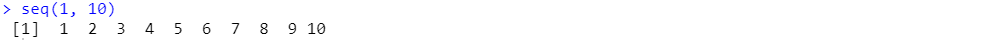
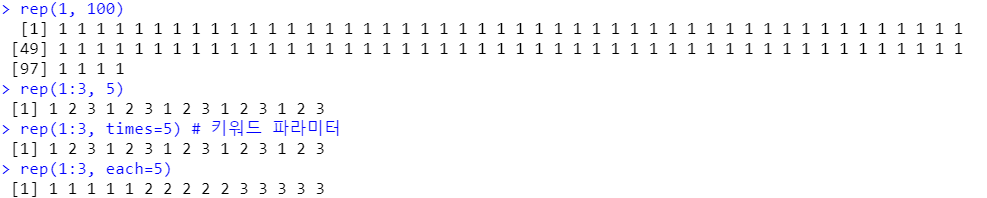
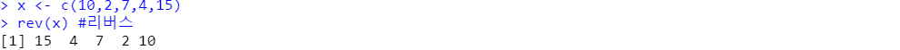
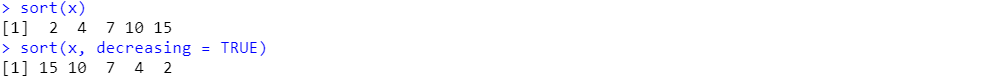
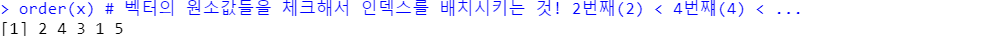
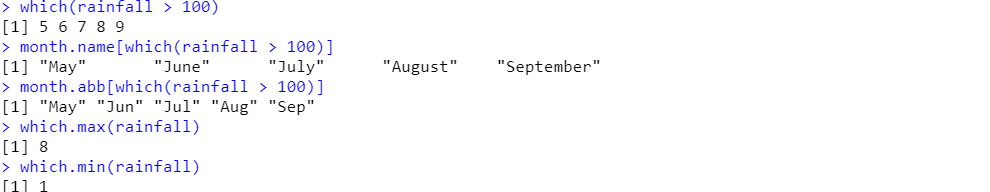
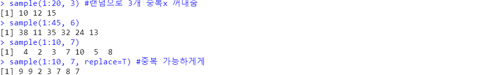
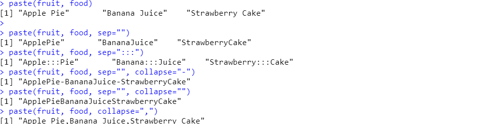

# R 구문공부

### 1. seq() : 숫자찍기

```R
s(1,10)
seq(1, 10, 2)
```




### 2. rep() : 반복

```R
rep(1,100)
rep(1:3,5)
rep(1:3, times=5)
rep(1:3, each=5)
```



​	

### 3. rev() : 리버스

```r
x <- c(10,2,7,4,15)
rev(x)
```




### 4. sort() : 오름차순 or 내림차순

```r
sort(x)
sort(x, decreasing = T)
```




### 5. order() : 원소값 체크해서 인덱스 배치

```r
order(x)
```




### 6. which() : 인덱스 값 추출

```r
rainfall <- c(21.6, 23.6, 45.8, 77.0, 
              102.2, 133.3,327.9, 348.0, 
              137.6, 49.3, 53.0, 24.9)
which(rainfall > 100)
month.name[which(rainfall > 100)]
month.abb[which(rainfall > 100)]
which.max(rainfall)
which.min(rainfall)

```



=> month.name과 month.abb은 R의 내장변수


### 7. sample() : 랜덤추출

```r
sample(1:20, 3) #랜덤으로 3개 중복x 꺼내줌
sample(1:45, 6)
sample(1:10, 7)
sample(1:10, 7, replace=T) #중복 가능하게
```




### 8. paste() : 문자열 결합

```r
fruit <- c("Apple", "Banana", "Strawberry")
food <- c("Pie","Juice", "Cake")
paste(fruit, food)

paste(fruit, food, sep="")
paste(fruit, food, sep=":::")
paste(fruit, food, sep="", collapse="-")
paste(fruit, food, sep="", collapse="")
paste(fruit, food, collapse=",")
```




 


