# matrix 실습


### matrix 생성

```r
x1 <-matrix(1:8, nrow = 2) # ncol 매개변수의 값을 생략
x1
x1<-x1*3
x1
sum(x1); min(x1);max(x1);mean(x1)
```

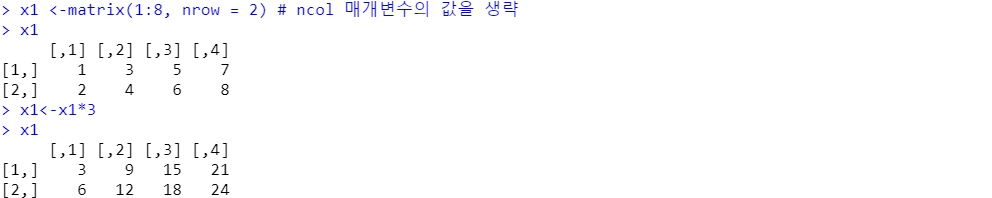

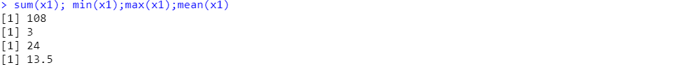

```r
chars <- letters[1:10]
mat1 <-matrix(chars)
mat1; dim(mat1)
matrix(chars, nrow=1)
matrix(chars, nrow=5)
matrix(chars, nrow=5, byrow=T) # row(행) 먼저
matrix(chars, ncol=5)
matrix(chars, nrow=3, ncol=5) # warning 뜨긴하지만 생성됨 앞의 원소값이 뒤에 채워짐
matrix(chars, nrow=3)         # warning 뜨긴하지만 생성됨 앞의 원소값이 뒤에 채워짐
```

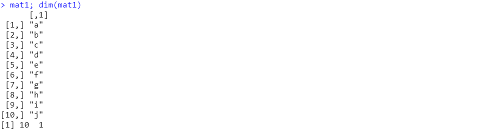

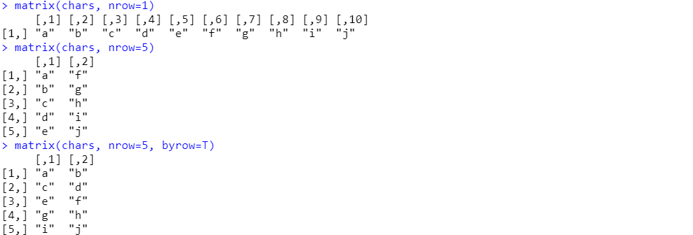

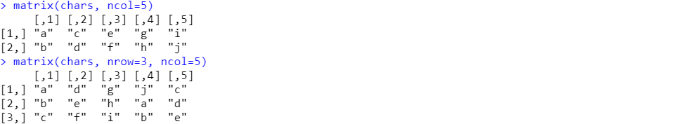

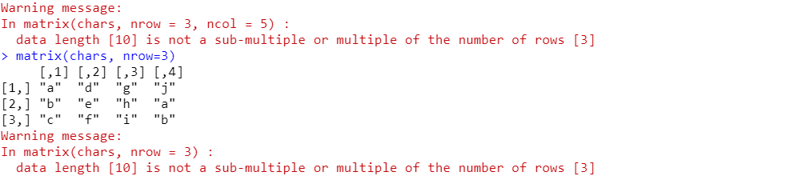


### matrix 값 추출&변경

```R
m <- matrix(chars, nrow=3)
m
m[1,1]
m[3,4]
m[3,4] <- 'w'
m
m[1,1, drop=F] # drop은 matrix 구조를 버리지 않고 추출하도록 할 때 사용
```

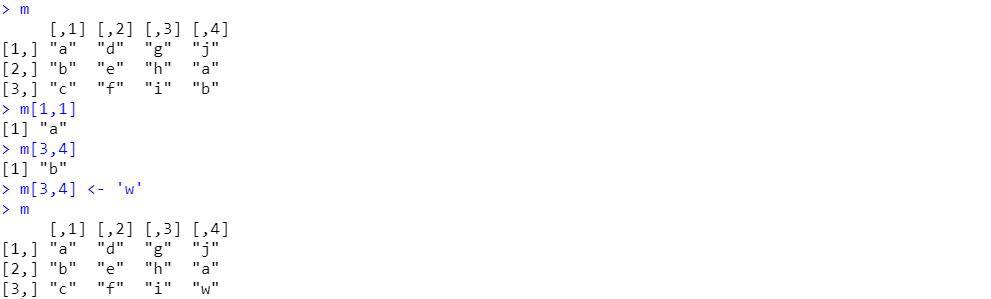


### matrix 행,열 이름 설정

```r
colnames(m)
rownames(m)

colnames(m) <- c('c1', 'c2', 'c3', 'c4')
rownames(m) <- c('r1', 'r2', 'r3')
m
```

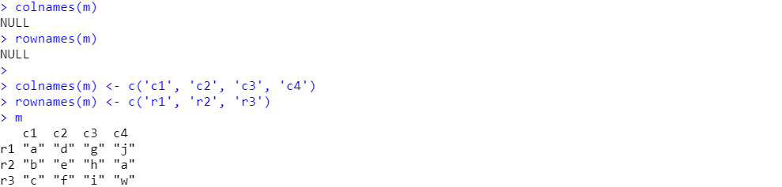


### rbind, cbind로 matrix 생성

```r
vec1 <- c(1,2,3)
vec2 <- c(4,5,6)
vec3 <- c(7,8,9)
mat1 <- rbind(vec1,vec2,vec3); mat1 #row기준
mat2 <- cbind(vec1,vec2,vec3); mat2
```

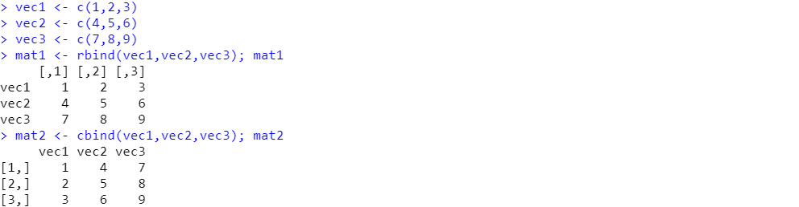


### apply 함수

```r
x2
apply(x2, 1, sum); apply(x2, 2, sum)  #1은 행, 2는 열
apply(x2, 1, max)
apply(x2, 1, min)
apply(x2, 1, mean)

apply(x2, 2, max)
apply(x2, 2, min)
apply(x2, 2, mean)
```

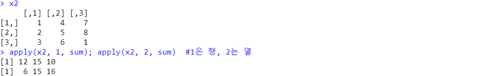

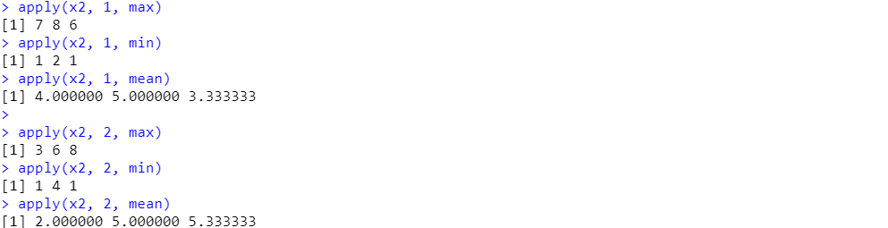


# Array 실습


### array 생성

```r
a1 <- array(1:30, dim=c(2,3,5)) # 3차원
a1
```

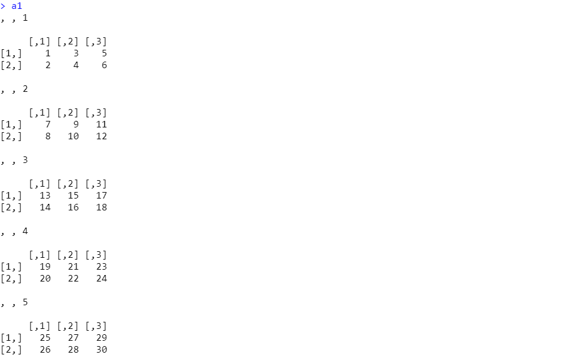


### array 추출

```r
a1[1,3,4]  # 행,열,층(면)
a1[,,3]    # 전체행,전체열,3층
a1[,2,]    # 전체행,2열,전체층
a1[1,,]	   # 1행,전체열,전체층
```

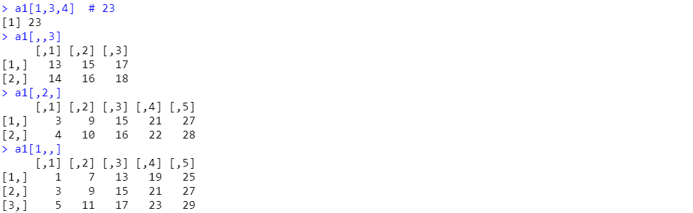


# factor 실습


### factor 로 변경하기 : factor()

```r
score <- c(1,3,2,4,2,1,3,5,1,3,3,3)
class(score)
summary(score)

f_score <- factor(score) # factor화 시키기
class(f_score) # factor
f_score # 원소의 종류도(level) 보여줌
summary(f_score) # 원소의 개수 보여줌
levels(f_score) # 종류(level)
```


### factor로 변경하기 : asfactor()

```R
f_score1 <- as.factor(score)
class(f_score1)
f_score1
summary(f_score1)
levels(f_score1)
```


### 빈도 수 그래프 : plot()

```R
plot(f_score)
```

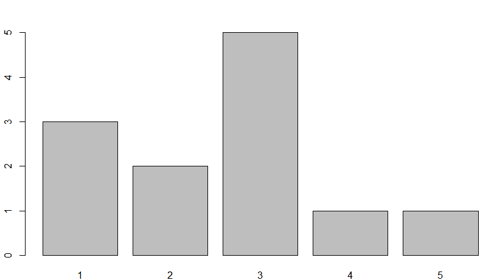


### level 직접 지정해서 확인하기

```r
data1 <- c("월","수","토","월", "수", "화", "수", "수",
           "목","화")
week.korabbname <- c("일", "월", "화",
                     "수", "목", "금", "토")
day2 <- factor(data1, 
               levels=week.korabbname)
day2
summary(day2)
levels(day2)
```

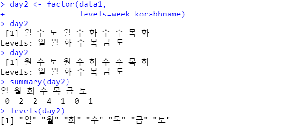


### data에 해당레벨이 아닌 값이 존재할 때 : NA값이 됨.

```r
btype <- factor(
  c("A", "O", "AB", "B", "O", "A", "O"), 
  levels=c("A", "B", "O"))
btype
summary(btype)
levels(btype)
```

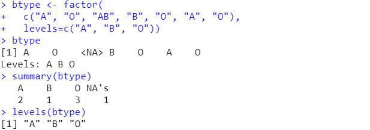


### label 지정해주기

```r
gender <- factor(c(1,2,1,1,1,2,1,2), 
                 levels=c(1,2), 
                 labels=c("남성", "여성"))
gender
summary(gender)
levels(gender)
```

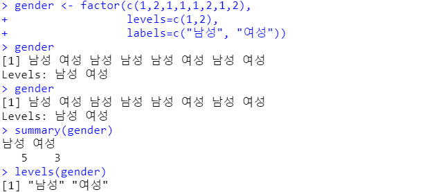


