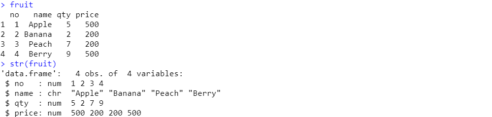
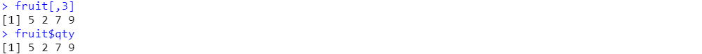
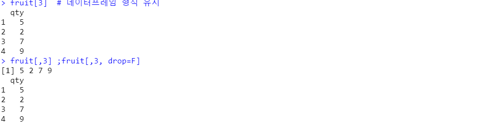
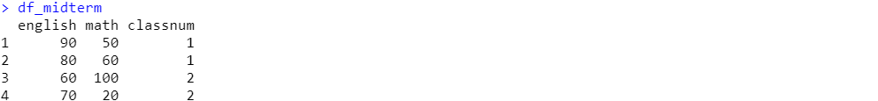
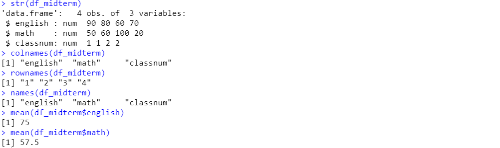
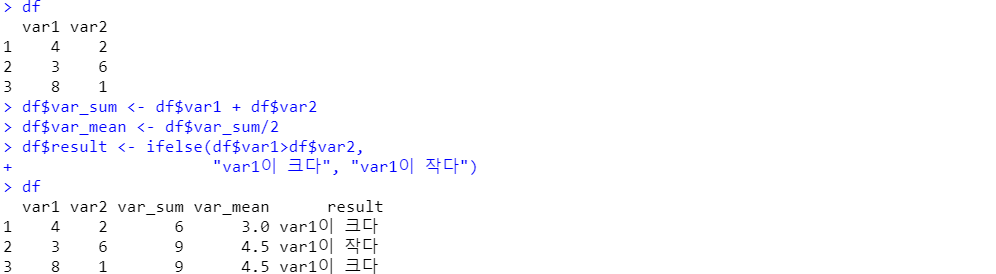

# Dataframe 실습

​	

### Dataframe 생성

```r
no <- c(1,2,3,4)
name <- c('Apple','Banana','Peach','Berry')
qty <- c(5,2,7,9)
price <- c(500,200,200,500)
fruit <- data.frame(no, name, qty, price) # 데이터프레임 생성
str(fruit) # 구조확인
```




### 데이터프레임 인덱싱 : matrix와 거의 동일하다고 보면 된다.

```r
fruit[,3]
fruit$qty
```




- dataframe 모양 유지하면서 인덱싱

```r
fruit[3]
fruit[,3] ;fruit[,3, drop=F]
```




### dataframe 예시1

```r
english <- c(90, 80, 60, 70)
math <- c(50, 60, 100, 20)
classnum <- c(1,1,2,2)
df_midterm <- data.frame(
  english, math, classnum)
df_midterm

str(df_midterm) # 구조확인
colnames(df_midterm) # column(열)이름
rownames(df_midterm) # row(행)이름
names(df_midterm) # column 이름
mean(df_midterm$english) # english 컬럼의 평균값
mean(df_midterm$math) # math 컬럼의 평균값
```






### dataframe 예시2 : 컬럼,로우 이름 지정

```r
df_midterm2
df_midterm2 <- data.frame(
  영어=c(90, 80, 60, 70), 
  수학=c(50, 60, 100, 20), 
  클래스=c(1,1,2,2))
df_midterm2


### 오류발생
df <- data.frame(var1=c(4,3,8), 
                 var2=c(2,6)) # 오류 : row(열)의 수가 맞지 않음.
```


### dataframe 예시3 : 값 변경 & 새로운 column 만들기

```r
df <- data.frame(var1=c(4,3,8), 
                 var2=c(2,6,1))
df
df$var_sum <- df$var1 + df$var2
df$var_mean <- df$var_sum/2
df$result <- ifelse(df$var1>df$var2, 
                    "var1이 크다", "var1이 작다")
df

# 위와같이 새로운 값을 지정하면 새로운 값이 생성되고, 있는 값을 새로 지정해주면 값이 변경되는 것이다.
```



