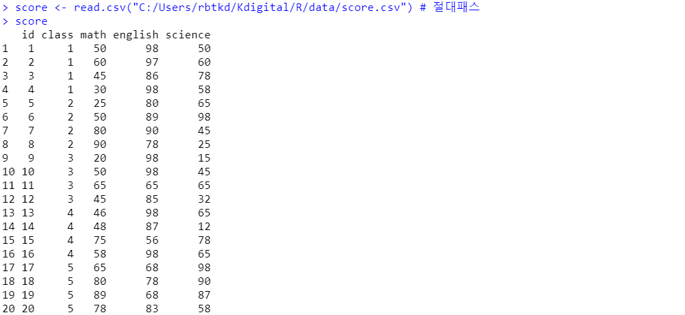
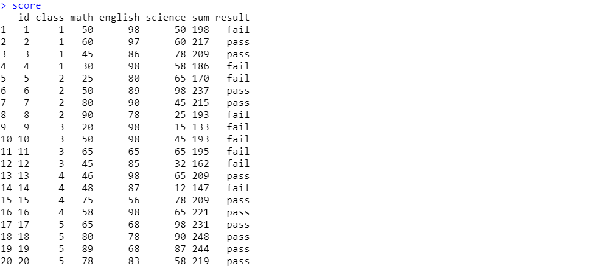
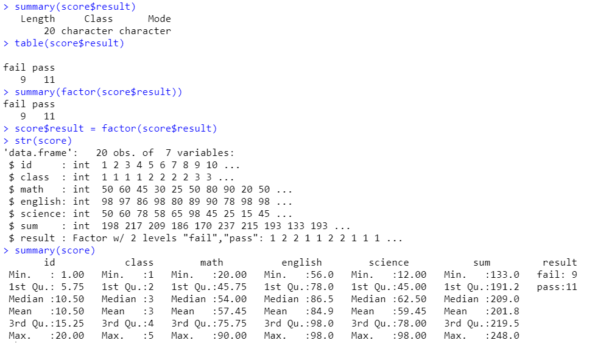
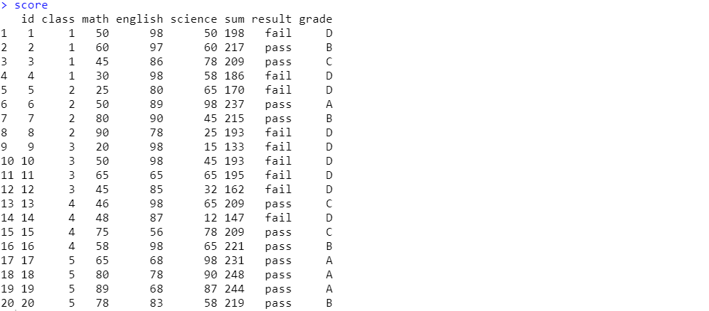
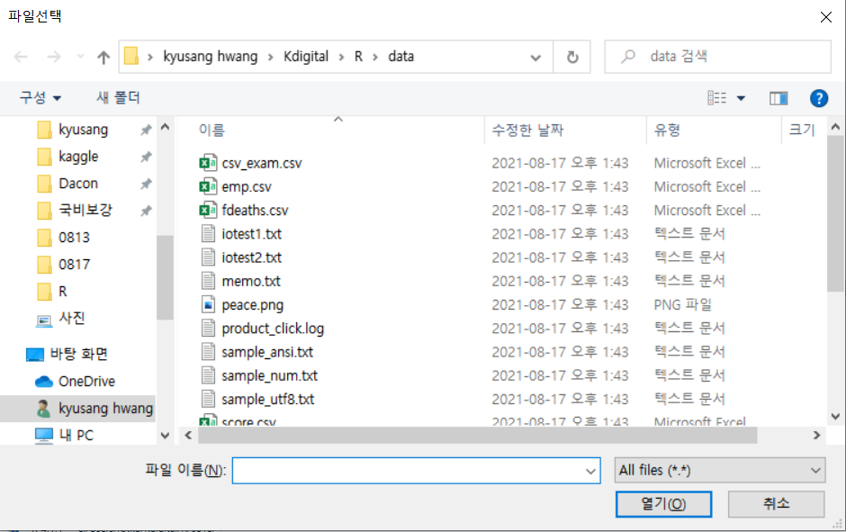
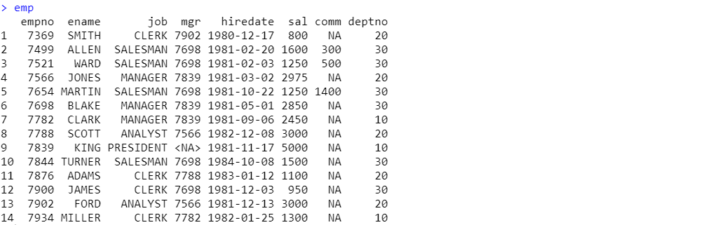
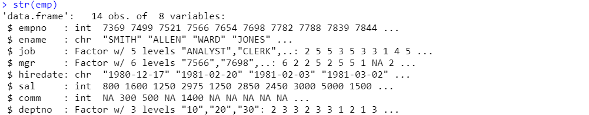
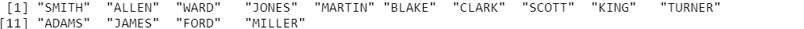
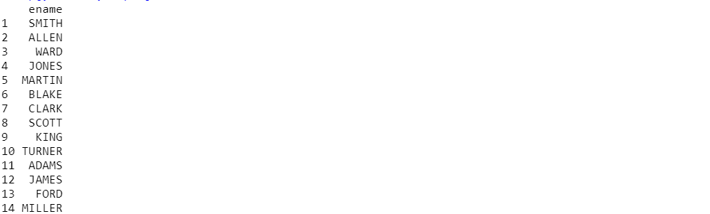
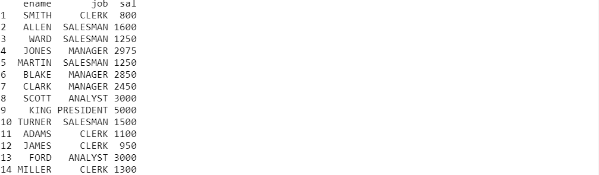

# CSV 파일 실습


### 실습1 : read.csv("패스")로 불러오기(csv는 dataframe 구조)

```R
score <- read.csv("C:/Users/rbtkd/Kdigital/R/data/score.csv") # 절대패스
score
```




- 새로운 column 추가 + 조건주기

```r
score$sum <- score$math+score$english+score$science
score$result <- ifelse(score$sum >= 200, "pass", "fail")
score
```




- result 컬럼 확인방법

```r
summary(score$result)
table(score$result)    # factor로 바꾸지 않아도 table 형식으로 알려줌
summary(factor(score$result))
score$result = factor(score$result) 
str(score)
summary(score)
```



- 새로운 column 3가지 범주로 생성

```r
score$grade<-ifelse(score$sum >= 230,"A",
                    ifelse(score$sum >= 215,"B", 
                           ifelse(score$sum >=200,"C","D")))
score
```




### 실습 2 : read.csv(file.choose())로 불러오기

```r
emp <- read.csv(file.choose())
emp
```



-> 위와같은 창이 뜨고 여기서 파일 선택하면 된다.




- as.factor() 통해 변수 속성 변경

```r
emp$job <- as.factor(emp$job)
emp$deptno <- as.factor(emp$deptno)
emp$mgr <- as.factor(emp$mgr)
str(emp)
```




- emp에서 직원 이름만 추출

```r
# 벡터형식으로
emp$ename
emp[,2]
emp[,"ename"] 

# 원래 형식 유지
emp[,2, drop=FALSE] 
emp[,"ename",drop=F] 
emp[2]
emp["ename"] 
```

1) 벡터 형식



2) 원래 형식 유지




- emp에서 직원이름, 직무, 급여

```r
emp[,c(2,3,6)]
emp[,c("ename","job","sal")]
subset(emp,select = c(ename, job, sal))
```




- emp에서 "KING"인 직원의 모든 정보 추출

```r
emp[9,] 
emp[c(F,F,F,F,F,F,F,F,T,F,F,F,
      F,F,F,F,F,F,F,F),]

emp$ename=="KING" # 이 결과는 FALSE FALSE .... 인 boolean으로 결과값이 나온다.

emp[emp$ename=="KING",]
subset(emp,subset=emp$ename=="KING")
subset(emp,emp$ename=="KING") 
```


- 커미션이 na인(정해지지 않은) 직원들의 모든 정보 출력

```r
emp[is.na(emp$comm),]
```


- 커미션이 na가 아닌 직원들의 모든 정보 출력

```r
emp[!is.na(emp$comm),]
subset(emp,!is.na(emp$comm)) 
```


- select ename,sal from emp where sal>=2000 의 구문 만족하게끔 추출

```r
subset(emp, emp$sal>= 2000, 
       c("ename","sal"))
subset(emp, select=c("ename","sal"), 
       subset= emp$sal>= 2000)
emp[emp$sal>=2000,c("ename","sal")]
```


- select ename,sal from emp where sal between 2000 and 3000 구문 만족하게끔 추출

```r
subset(emp, sal>=2000 & sal<=3000, c("ename","sal"))
emp[emp$sal>=2000 & emp$sal <=3000, c("ename","sal")]
```

