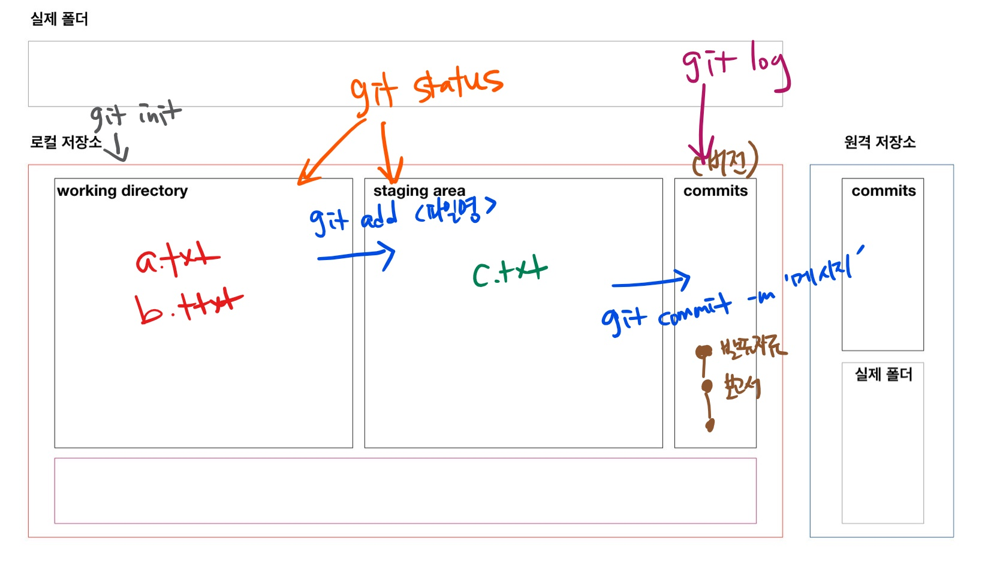

# git 기초

> 분산버전관리시스템(DVCS, Distributed Version Control System)

## git 설치

윈도우 환경에서는 기본적으로 git이 없어 git bash를 설치하여 활용한다. [설치링크](https://git-scm.com/download/win)

## 기본 문법

### git 저장소 초기화(생성)

```bash
$ git init
Initialized empty Git repository in C:/git/git_kdigital/first/.git/(maser) $
```

- `.git`숨김 폴더에 git과 관련된 모든 정보가 담겨 있음

### add

```bash
$ git add <디렉토리>
$ git add a.txt # 파일 하나만
$ git add a.txt b.txt report.hwp # 여러 파일
$ git add my_folder/ # 특정 폴더
$ git add . # 현재 디렉토리 모든 파일/폴더
```

- `working directory`의 변경사항을 `staging area` 상태로 변경

#### add 전

```bash
$ touch a.txt

$ git status
On branch master

No commits yet
# 트래킹되고 있지 않은 파일들
# working Directory
Untracked files:
# git add 를 사용
# 커밋될 것에 포함시키기 위하여..
# staging area에 포함시키기 위하여..
  (use "git add <file>..." to include in what will be committed)
        a.txt
# 커밋될 것이 없다. (SA - X)
# 하지만, untracked files 있다. (WD - O)
nothing added to commit but untracked files present (use "git add" to track)
```

```bash
# a.txt 파일 add 후 commit 후 ppt.pdf, ppt.pptx, report.hwp 파일 생성

$ git status
On branch master
Untracked files:
  (use "git add <file>..." to include in what will be committed)
        ppt.pdf
        ppt.pptx
        report.hwp
        
nothing added to commit but untracked files present (use "git add" to track)

```

#### add 이후

```bash
$ git add report.hwp

$ git status
On branch master
Changes to be committed:
  (use "git restore --staged <file>..." to unstage)
        new file:   report.hwp

Untracked files:
  (use "git add <file>..." to include in what will be committed)
        ppt.pdf
        ppt.pptx

```

### commit

```bash
# $ git commit -m '커밋메세지'

$ git commit -m '리포트 작업'
[master 6796ce4] 리포트 작업
 1 file changed, 0 insertions(+), 0 deletions(-)
 create mode 100644 report.hwp

$ git status
On branch master
Untracked files:
  (use "git add <file>..." to include in what will be committed)
        ppt.pdf
        ppt.pptx

$ git log
commit 6796ce4bc32fa1cfff48e2f4309ab55a7c1919a2 (HEAD -> master)
Author: kyusangHwang0912 <rbtkd912@gmail.com>
Date:   Mon Jul 5 11:23:59 2021 +0900

    리포트 작업

commit eb2c30792181b089c5b82a98079341c9b5a3c7dd
Author: kyusangHwang0912 <rbtkd912@gmail.com>
Date:   Mon Jul 5 11:09:51 2021 +0900

    Add a.txt

$ git add .

$ git status
On branch master
Changes to be committed:
  (use "git restore --staged <file>..." to unstage)
        new file:   ppt.pdf
        new file:   ppt.pptx


rbtkd@LAPTOP-V7B21GPH MINGW64 /c/git/git_kdigital/first (master)

$ git commit -m '발표자료 작업'
[master 98dac15] 발표자료 작업
 2 files changed, 0 insertions(+), 0 deletions(-)
 create mode 100644 ppt.pdf
 create mode 100644 ppt.pptx

```

- 커밋메세지는 버전을 나타낼 수 있도록 잘 작성해야 함!
- 커밋 해시 값은 고유한 커밋을 나타냄(ID값)
- 커밋 목록을 확인하기 위해서는 `git log` 명령어를 사용

### git 상태 확인

#### status

```bash
$ git status
```

- Working directory, Staging area의 상태를 확인할 수 있음

#### log

```bash
# $ git log

$ git log --oneline # 한 줄로
98dac15 (HEAD -> master) 발표자료 작업
6796ce4 리포트 작업
eb2c307 Add a.txt

$ git log -2 # 최근 2개
commit 98dac15c815fb872b3d23f5d331d06d11d44411f (HEAD -> master)
Author: kyusangHwang0912 <rbtkd912@gmail.com>
Date:   Mon Jul 5 11:24:32 2021 +0900

    발표자료 작업

commit 6796ce4bc32fa1cfff48e2f4309ab55a7c1919a2
Author: kyusangHwang0912 <rbtkd912@gmail.com>
Date:   Mon Jul 5 11:23:59 2021 +0900

$ git log -2 --oneline # 한 줄로 최근 2개
98dac15 (HEAD -> master) 발표자료 작업
6796ce4 리포트 작업

```

### 사진 예시




###### >> rm -rf .git 으로 init 잘못했을 시 삭제 가능하다.


