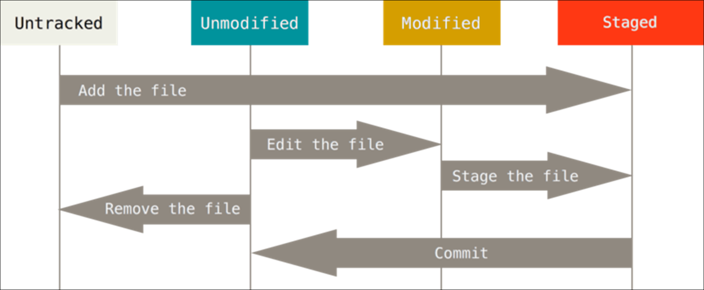

# Lifecycle

> 파일이 가질 수 있는 상태

* Untracked
* Tracked
  * Unmodified -> status에 나오지는 않는다
  * Modified
  * Staged


```bash
$ git status
On branch master
# 커밋될 변경사항들(Staging area - 두번째통)
Changes to be committed:
  (use "git restore --staged <file>..." to unstage)
  # 생성/삭제/수정
        deleted:    c.txt
        new file:   e.txt

# 변경사항인데, staged가 아닌 것(Working directory - 첫번째통)
Changes not staged for commit:
  (use "git add <file>..." to update what will be committed)
  (use "git restore <file>..." to discard changes in working directory)
  # 수정
        modified:   b.txt

# 트래킹되고 있지 않은 파일들(Working directory)
# 한번도 버전에 들어간 적 없는 파일
Untracked files:
  (use "git add <file>..." to include in what will be committed)
        d.txt

```


