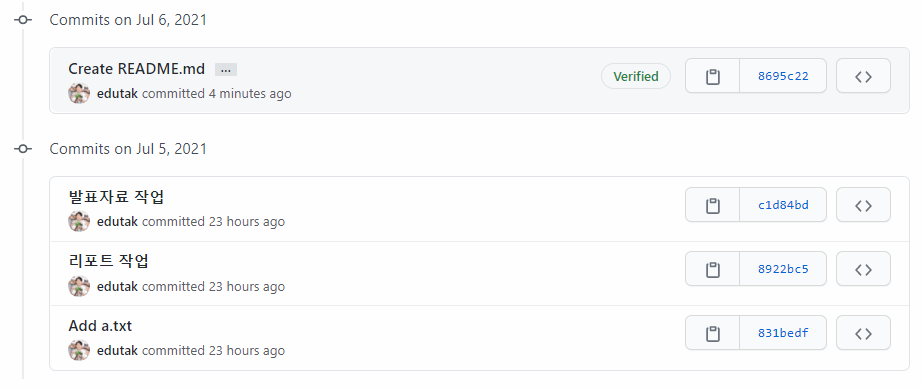
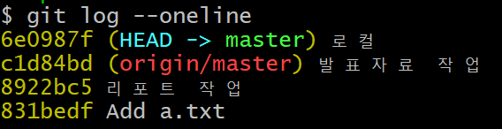
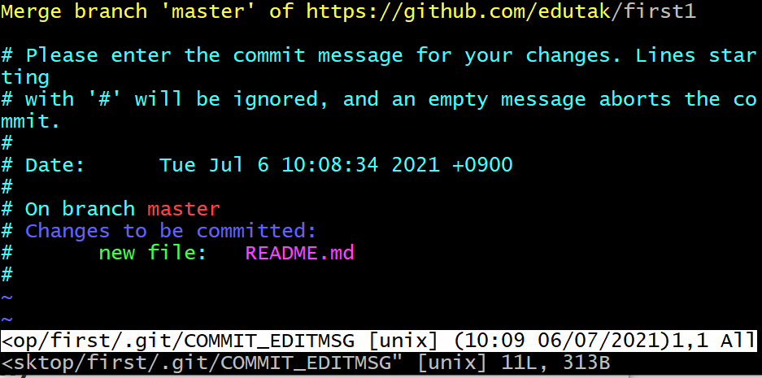

# push conflict

```bash
$ git push origin master
To https://github.com/edutak/first1.git
# 거절됨
 ! [rejected]        master -> master (fetch first)
# error / failed
error: failed to push some refs to 'https://github.com/edutak/first1.git'
# 변경사항들(커밋..) 거절
# 원격저장소 작업이 로컬에 없다. (커밋 로그 일치 X)
hint: Updates were rejected because the remote contains work that you do
hint: not have locally. This is usually caused by another repository pushing
hint: to the same ref. 
# 너는 원할것.. 다시 push하기전에 원격저장소의 변경사항들을 먼저(first) 통합하기를..
# 예시로 git pull..
You may want to first integrate the remote changes
hint: (e.g., 'git pull ...') before pushing again.
hint: See the 'Note about fast-forwards' in 'git push --help' for details.

```

## 원인 파악





## 해결

### 1. 원격저장소 내용 가져옴(pull)

```bash
$ git pull origin master
```

## 2. 머지 커밋

> Vim - CLI 환경 텍스트에디터
>
> 저장하기 위해서는 `esc` `:` `w` `q`를 누르고 엔터
>
> w - write / q - quit 

