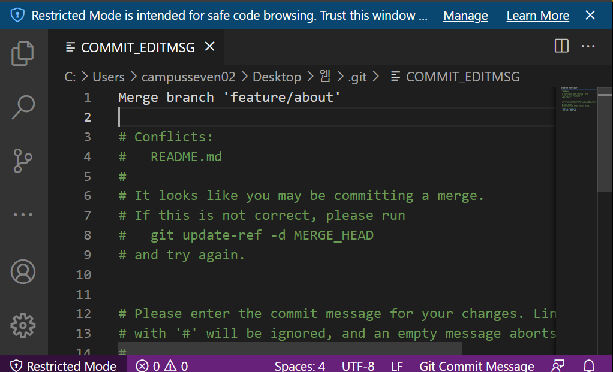

준비

> 반드시 Root commit이 있는 상태에서 브랜치를 조작해야 합니다.

* 폴더를 만들고, README.md 파일을 만든 후 커밋을 해주세요.

### 상황 1. fast-foward

> fast-foward는 feature 브랜치 생성된 이후 master 브랜치에 변경 사항이 없는 상황

1. feature/index branch 생성 및 이동

   ```bash
   $ git checkout -b feature/index
   Switched to a new branch 'feature/index'
   
   $ touch index.txt
   $ touch index.html
   ```

   

2. 작업 완료 후 commit

   ```bash
   git add .
   
   $ git commit -m "Complete index page"
   [feature/index 2d6f371] Complete index page
    2 files changed, 0 insertions(+), 0 deletions(-)
    create mode 100644 index.html
    create mode 100644 index.txt
    
   $ git log --oneline
   2d6f371 (HEAD -> feature/index) Complete index page
   fc2e26d (master) Create README.md
   
   
   ```


3. master 이동

   ```bash
   $ git checkout master
   Switched to branch 'master'
   ```


4. master에 병합

   ```bash
   $ git merge feature/index
   Updating fc2e26d..2d6f371
   Fast-forward
    index.html | 0
    index.txt  | 0
    2 files changed, 0 insertions(+), 0 deletions(-)
    create mode 100644 index.html
    create mode 100644 index.txt
   
   ```


5. 결과 -> fast-foward (단순히 HEAD를 이동)

   ```bash
   $ git log --oneline
   2d6f371 (HEAD -> master, feature/index) Complete index page
   fc2e26d Create README.md
   ```

6. branch 삭제

   ```bash
   $ git branch -d feature/index
   Deleted branch feature/index (was 2d6f371).
   
   $ git log
   commit 2d6f3710426f943214d6c07f4169039face00ce9 (HEAD -> master)
   Author: kyusangHwang0912 <rbtkd912@gmail.com>
   Date:   Tue Jul 6 13:32:24 2021 +0900
   
   ```
   
   

---

### 상황 2. merge commit

> 서로 다른 이력(commit)을 병합(merge)하는 과정에서 다른 파일이 수정되어 있는 상황
>
> git이 auto merging을 진행하고, commit이 발생된다.

1. feature/style branch 생성 및 이동

   ```bash
   $ git checkout -b feature/style
   ```

2. 작업 완료 후 commit

   ```bash
   $ touch index.css
   $ git add .
   $ git commit -m 'complete index css'
   
   $ git log --oneline
   e2ae521 (HEAD -> feature/style) complete index css
   2d6f371 (master) Complete index page
   fc2e26d Create README.md
   ```

3. master 이동

   ```bash
   $ git checkout master
   ```

4. *master에 추가 commit 발생시키기!!*

   * **다른 파일을 수정 혹은 생성하세요!**

   ```bash
   $ touch hotfix.txt
   $ git add .
   $ git commit -m "Hotfix"
   [master b67fa44] Hotfix
    1 file changed, 0 insertions(+), 0 deletions(-)
    create mode 100644 hotfix.txt
   
   $ git log --oneline
   b67fa44 (HEAD -> master) Hotfix
   2d6f371 Complete index page
   fc2e26d Create README.md
   ```

5. master에 병합

   ```bash
   $ git merge feature/style
   ```

6. 결과 -> 자동으로 *merge commit 발생*

   * vim 편집기 화면이 나타납니다.
   * 자동으로 작성된 커밋 메시지를 확인하고, `esc`를 누른 후 `:wq`를 입력하여 저장 및 종료를 합니다.
      * `w` : write
      * `q` : quit
   * 커밋  확인 해봅시다.
   
   ```bash
   $ git merge feature/style
   Merge made by the 'recursive' strategy.
    index.css | 0
    1 file changed, 0 insertions(+), 0 deletions(-)
    create mode 100644 index.css
   ```
   
   
   
7. 그래프 확인하기

   ```bash
   $ git log --oneline --graph
   *   11e00f4 (HEAD -> master) Merge branch 'feature/style'
   |\
   | * e2ae521 (feature/style) complete index css
   * | b67fa44 Hotfix
   |/
   * 2d6f371 Complete index page
   * fc2e26d Create README.md
   
   ```

8. branch 삭제

   ```bash
   $ git branch -d feature/style
   ```
   
   

---

### 상황 3. merge commit 충돌

> 서로 다른 이력(commit)을 병합(merge)하는 과정에서 동일 파일이 수정되어 있는 상황
>
> git이 auto merging을 하지 못하고, 해당 파일의 위치에 라벨링을 해준다.
>
> 원하는 형태의 코드로 직접 수정을 하고 merge commit을 발생 시켜야 한다.

1. feature/about branch 생성 및 이동

   ```bash
   $ git checkout -b feature/about
   Switched to a new branch 'feature/about'
   ```

2. 작업 완료 후 commit *추가적으로 README.md에 내용을 추가해주세요*

   ``` bash
   # README.md 수정 후 저장
   $ touch about.html
   $ git status
   On branch feature/about
   Changes not staged for commit:
     (use "git add <file>..." to update what will be committed)
     (use "git restore <file>..." to discard changes in working directory)
           modified:   README.md
   
   Untracked files:
     (use "git add <file>..." to include in what will be committed)
           about.html
   
   no changes added to commit (use "git add" and/or "git commit -a")
   
   $ git add .
   $ git commit -m "Update [README.md] & Create [about.html]"
   [feature/about 981b1fc] Update [README.md] & Create [about.html]
    2 files changed, 1 insertion(+)
    create mode 100644 about.html
   
   $ git log --oneline
   981b1fc (HEAD -> feature/about) Update [README.md] & Create [about.html]
   11e00f4 (master) Merge branch 'feature/style'
   b67fa44 Hotfix
   e2ae521 complete index css
   2d6f371 Complete index page
   fc2e26d Create README.md 
   ```


3. master 이동

   ```bash
   $ git checkout master
   ```


4. *master에 추가 commit 발생시키기!!*

   * **동일 파일을 수정 혹은 생성하세요! (README에 내용을 아까와 다르게 작성해주세요) **
   
   ```bash
   # README 수정(conflict가 표시되어 있음)
   $ git status
   On branch master
   Changes not staged for commit:
     (use "git add <file>..." to update what will be committed)
     (use "git restore <file>..." to discard changes in working directory)
           modified:   README.md
   
   no changes added to commit (use "git add" and/or "git commit -a")
   
   
   $ git add .
   $ git commit -m "Update README.md"
   [master b344c4b] Update README.md
    1 file changed, 1 insertion(+)
   $ git log --oneline
   b344c4b (HEAD -> master) Update README.md
   11e00f4 Merge branch 'feature/style'
   b67fa44 Hotfix
   e2ae521 complete index css
   2d6f371 Complete index page
   fc2e26d Create README.md
   
   ```
   
5. master에 병합

   ```bash
   $ git merge feature/about
   Auto-merging README.md
   # Conflict !!!!!
   # READE.md에서 conflict!!!
   CONFLICT (content): Merge conflict in README.md
   # 자동 머지 실패; 충돌 고치고 커밋해라
   Automatic merge failed; fix conflicts and then commit the result.
   
   ## 이 아래 나오는 커맨드줄
   (master|MERGING)
   $
   
   
   ```


6. 결과 -> *merge conflict발생*

   ```bash
   $ git status
   On branch master
   You have unmerged paths.
     (fix conflicts and run "git commit")
     (use "git merge --abort" to abort the merge)
   
   Changes to be committed:
           new file:   about.html
   # 충돌 파일!!
   Unmerged paths:
     (use "git add <file>..." to mark resolution)
           both modified:   README.md
   
   
   ```


7. 충돌 확인 및 해결

   ```bash
   <<<<<<< HEAD
   #  master 브랜치 수정
   =======
   ## 시나리오3!!! 수정
   >>>>>>> feature/about
   ```


8. merge commit 진행

    ```bash
    $ git add .
    $ git commit
   ```
   
   * vim 편집기 화면이 나타납니다.
   * 자동으로 작성된 커밋 메시지를 확인하고, `esc`를 누른 후 `:wq`를 입력하여 저장 및 종료를 합니다.
      * `w` : write
      * `q` : quit
   * 커밋이  확인 해봅시다.
   
   
   
   ``` bash
   $ git commit
   [master a3b1ac1] Merge branch 'feature/about'
   ```
   
9. 그래프 확인하기

    ```bash
    $ git log --oneline --graph
    *   a3b1ac1 (HEAD -> master) Merge branch 'feature/about'
    |\
    | * 981b1fc (feature/about) Update [README.md] & Create [about.html]
    * | b344c4b Update README.md
    |/
    *   11e00f4 Merge branch 'feature/style'
    |\
    | * e2ae521 complete index css
    * | b67fa44 Hotfix
    |/
    * 2d6f371 Complete index page
    * fc2e26d Create README.md
    
    ```


10. branch 삭제

    ```bash
    $ git branch -d feature/about
    $ git log --oneline
    a3b1ac1 (HEAD -> master) Merge branch 'feature/about'
    b344c4b Update README.md
    981b1fc Update [README.md] & Create [about.html]
    11e00f4 Merge branch 'feature/style'
    b67fa44 Hotfix
    e2ae521 complete index css
    2d6f371 Complete index page
    fc2e26d Create README.md
    ```
    
    
    
    
