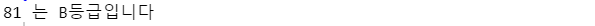
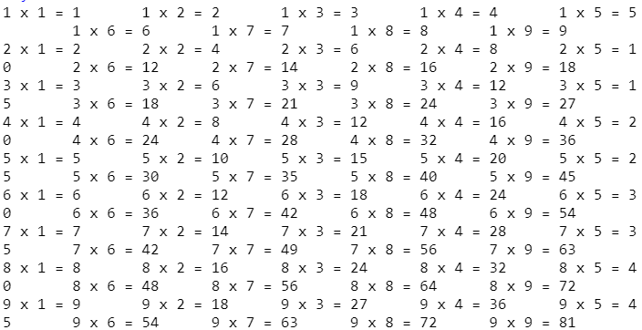
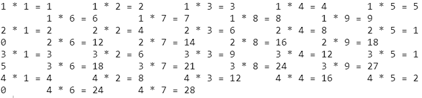
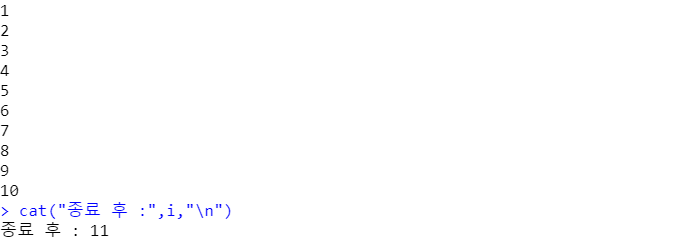
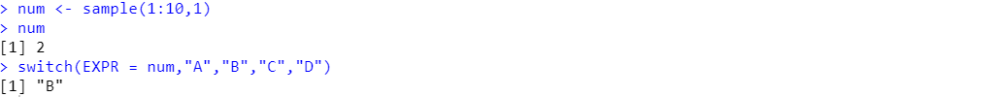
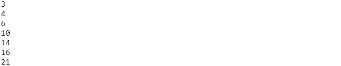

# cat() 출력


### print()와 다른 점

R에서의 print()는 파이썬과 달리 +(R에서의 +는 무조건 숫자만!)는 물론이고 한개의 문장?만 출력이 가능하다. 따라서 cat(data,"는 이겁니다") 이런식으로 출력하기 위해 cat함수를 사용한다.

하지만 끝에 \n를 출력해주지 않으면 자동 개행이 안됨으로 주의할 필요가 있다. 그리고 인용구("")도 자동으로 출력되지 않는다!


# 제어문

- if문(if,else if, else) 실습

```r
score <- sample(0:100, 1)  # 0~100 숫자 한 개를 무작위로 뽑아서
if (score >=90){
  cat(score,"는 A등급입니다","\n")
}else if (score >=80){
  cat(score,"는 B등급입니다","\n")
}else if (score >=70){
  cat(score,"는 C등급입니다","\n")
}else if (score >=60){
  cat(score,"는 D등급입니다","\n")
}else {
  cat(score,"는 F등급입니다","\n")
}
```




- for문 실습(구구단)

```
for(dan in 1:9){
  for(num in 1:9){
    cat(dan,"x",num,"=",dan*num,"\t") # \n : 개행문자, \t : 탭문자
  }
  cat("\n")
}
```




- - for문 안에 break

```r
bb <- F
for(i in 1:9){
  for(j in 1:9){
    if(i*j>30){
      bb<-T
      break
    } 
    cat(i,"*",j,"=",i*j,"\t")
  }
  cat("\n")
  if(bb) #bb가 TRUE이면
    break
}
```




- while 문

```r
i<-1
while(i <= 10){
  cat(i,"\n")
  i <- i+1
}
cat("종료 후 :",i,"\n")
```




- switch 문 : 특정값에 원하는 값을 대입시키는 함수 (switch 시키는 것!) 

```r
(month <- sample(1:12,1))
month <- paste(month,"월",sep="")
result <- switch(EXPR=month,
                 "12월"=,"1월"=,"2월"="겨울",
                 "3월"=,"4월"=,"5월"="봄",
                 "6월"=,"7월"=,"8월"="여름",
                 "가을")
cat(month,"은 ",result,"입니다\n",sep="")
```


- - 특정값지정 안해주면 아래처럼 숫자는 특정 순서를 의미함!

```r
num <- sample(1:10,1) 
num
switch(EXPR = num,"A","B","C","D")
```




- repeat() : 반복!

```r
sumNumber <- 0
repeat { 
  i <- sample(1:5, 1) 
  sumNumber <-sumNumber+i; 
  cat(sumNumber,"\n")
  if(sumNumber > 20)
    break;
}
```



