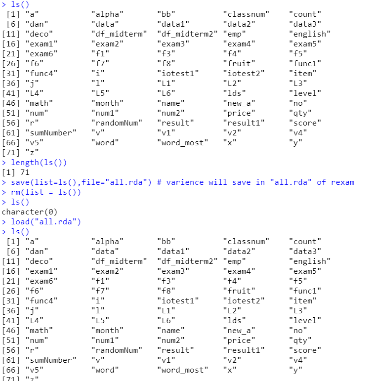
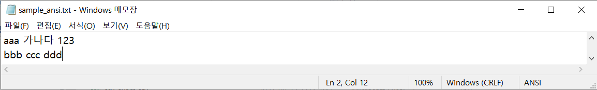
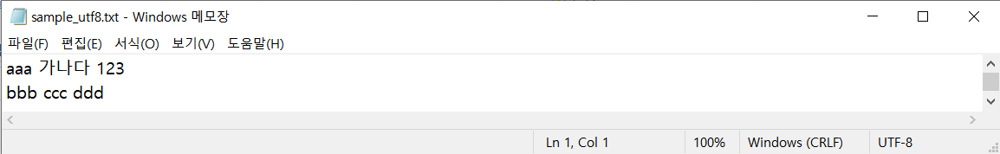
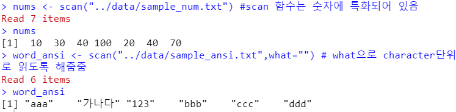
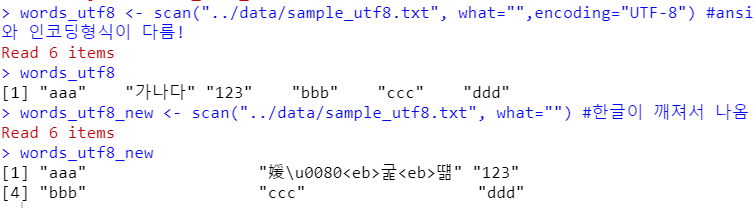
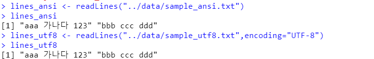

# 파일 저장 & 불러오기


### 파일 입력(이때까지의 변수 파일 저장)

```r
ls() # 변수 목록
length(ls()) # 변수의 개수(length함수 이용)
save(list=ls(),file="all.rda") # varience will save in "all.rda" of rexam
rm(list = ls()) # 변수 지우기
ls() # 목록이 없음
load("all.rda") # 다시 불러오기
ls() # 변수 목록이 다시 불러와짐
```




### 파일 불러오기

- scan() : 숫자를 기본으로 파일을 scan(훑는다.)하는 함수 (what으로 타입지정가능)

```r
nums <- scan("data/sample_num.txt") #scan 함수는 숫자에 특화되어 있음
nums
word_ansi <- scan("data/sample_ansi.txt",what="") # what으로 character단위로 읽도록 해줌
words_utf8 <- scan("data/sample_utf8.txt", what="",encoding="UTF-8") #ansi와 인코딩형식이 다름! 
words_utf8
words_utf8_new <- scan("data/sample_utf8.txt", what="") #한글이 깨져서 나옴
words_utf8_new
```

-> 파일확인





-> 실행결과






- readLines() : 개행단위로 불러오기

```r
lines_ansi <- readLines("../data/sample_ansi.txt")
lines_ansi
lines_utf8 <- readLines("../data/sample_utf8.txt",encoding="UTF-8")
lines_utf8
```




