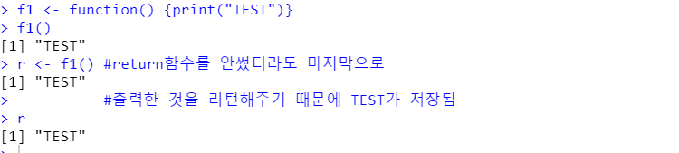
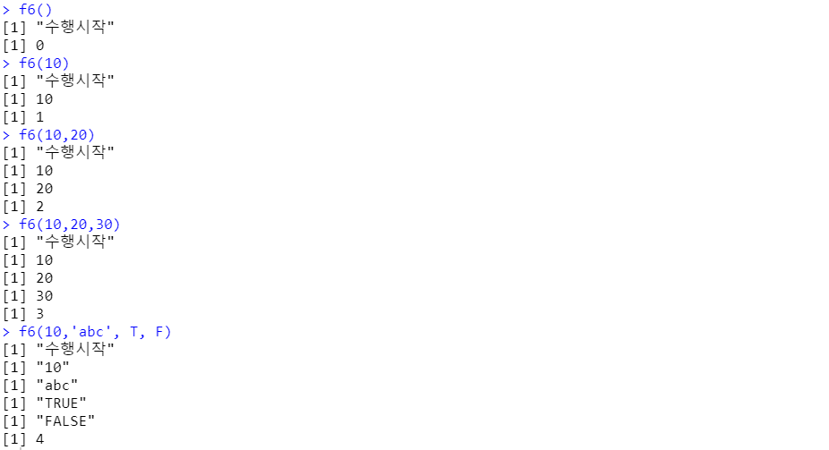
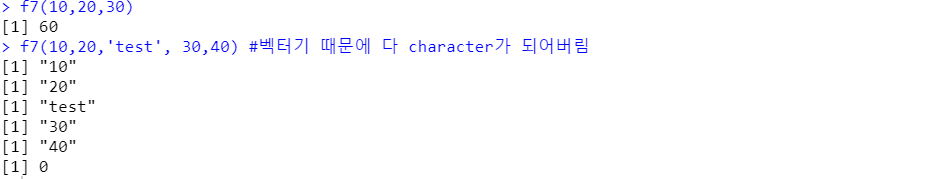

# 함수 정의와 활용


### 함수 생성

```r
f1 <- function() {print("TEST")}
f1()
r <- f1() #return함수를 안썼더라도 마지막으로 
          #출력한 것을 리턴해주기 때문에 TEST가 저장됨
		  #파이썬은 null을 리턴
```




- 함수 생성 & 활용

```r
f6<- function(...) {
  print("수행시작")
  data <- c(...)
  for(item in data) {
    print(item)
  }
  return(length(data))
}
f6()
f6(10)
f6(10,20)
f6(10,20,30)
f6(10,'abc', T, F)
```




- 벡터와 리스트 차이 확인

```R
f7<- function(...) {
  data <- c(...)
  sum <- 0;
  for(item in data) {
    if(is.numeric(item))
      sum <- sum + item
    else
      print(item)
  }
  return(sum)
}
f7(10,20,30)
f7(10,20,'test', 30,40) #벡터기 때문에 다 character가 되어버림
```




```r
f8<- function(...) {
  data <- list(...)
  sum <- 0;
  for(item in data) {
    if(is.numeric(item))
      sum <- sum + item
    else
      print(item)
  }
  return(sum)
}

f8(10,20,30)
f8(10,20,"test", 30,40)
```


