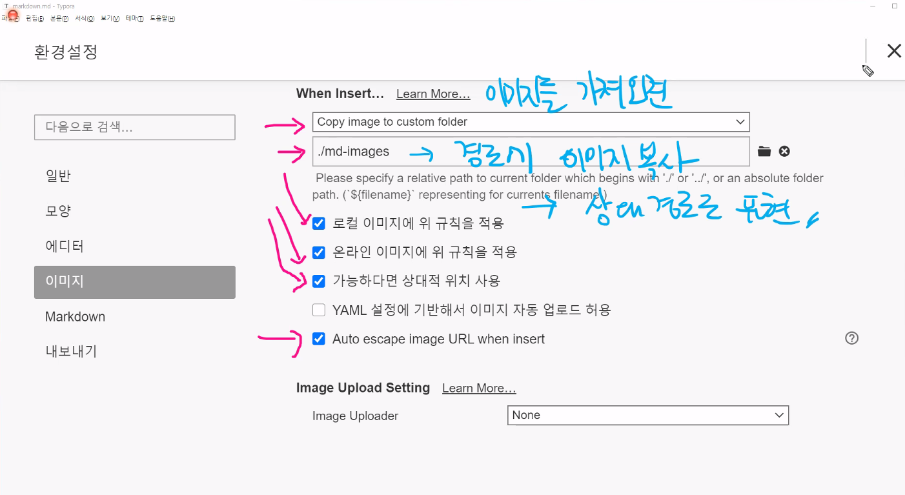

# 마크다운 문법

## 제목(heading)

문서의 구조를 잡기 위한 제목은 #을 통해 표현한다. #의 개수로 제목의 레벨을 지정한다.

### 제목3

#### 제목4

##### 제목5

###### 제목6(마지막)


## 목록(list)

목록은 순서가 있는 목록과 순서가 없는 목록으로 구분된다.

1. 목록1
2. 목록2
   1. 목록2-1(tab)
   2. 목록2-2
3. 나올때는 shift+tab (끝내고 싶으면 여기서 enter)

* 순서가 없는 목록
* 순서가 없는 목록
  * tab하면 하위목록
* shift + tab (끝내고싶으면 여기서 enter)


## 코드 블록(중요)

특정한 코드를 작성할 때 코드 블록을 활용하면, 언어별 syntax highlighting 기능이 제공됨(`[백팁?]은 숫자1왼쪽)

``` python
num = 10
if num % 2:
    print('짝수')
```

``` html
<!-- Html의 주석 -->
<h1>
    안녕하세요
</h1>
```

``` sql
SELECT
*
FROM
TABLE_NAME
```


## 인라인 코드블록(``)

`if` 는 파이썬 조건문에서 활용되는 키워드입니다.


## 표 (위의 메뉴에서 본문 -> 표 -> 표삽입)

| 이름   | 나이 | 비고 |
| ------ | ---- | ---- |
| 황규상 | 27   |      |
| 홍길동 | 28   |      |
| 김철수 | 29   |      |


## 그림

]


- typora에 아래와 같이 설정하면,  상대 경로로 쉽게 이미지 파일을 관리할 수 있다.

  

  

## 링크

[구글](https://google.com)


## 인용문

> 인용문은 >를 통해 만듭니다.(보통 한줄 정의를 하거나할때 사용하기도 함)

----


## 기타

**굵게(볼드체)**

*기울임(이탤릭체)*

---

~~취소선~~


